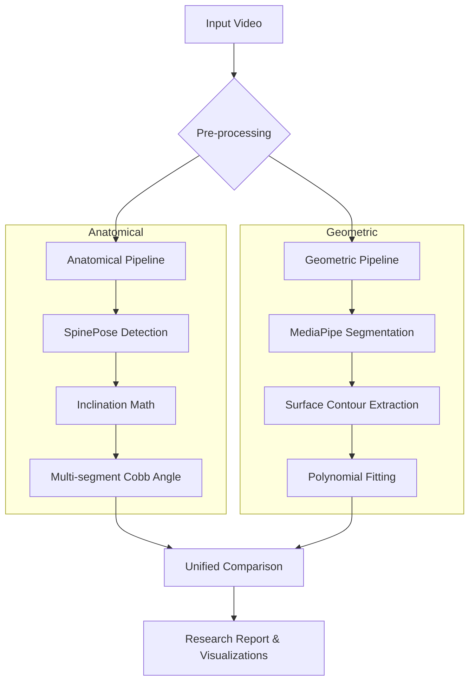

# 🧬 Spinal Posture Analysis Framework (NRMA)

[](#)
[](#)
[](#)
[](#)

A comprehensive, dual-pipeline framework for non-invasive spinal posture analysis using computer vision. This tool enables direct comparison between **Geometric Back Surface Curvature** and **Anatomical Keypoint-based (SpinePose)** spinal estimation.

---

## 📌 Project Overview

This framework implements a **Neck-Rib-Mid-Abdomen (NRMA)** branching logic to analyze spinal alignment from side-view RGB videos. It is designed for researchers and biomechanists seeking a low-cost, non-invasive alternative to radiographic imaging for trend analysis.

### Core Pipelines
1.  **Anatomical Method**: Utilizes the **SpinePose** (CVPR 2025) 37-keypoint model for precise vertebral landmark detection (C1-Sacrum).
2.  **Geometric Method**: Uses **MediaPipe Selfie Segmentation** to extract the external back surface contour and estimate curvature through high-order polynomial fitting.

---

## 🏗️ System Architecture



---

## 📂 Directory Structure

```text
/
├── config.py                # Global research parameters & directory configs
├── spine_analysis.py        # Anatomical (SpinePose) analysis module
├── surface_curvature_analysis.py # Geometric (Surface) analysis module
├── unified_comparison.py     # Cross-method synchronization & reporting
├── data/
│   ├── raw/                 # Input videos (.mp4)
│   └── outputs/             # Generated plots, CSVs, and videos
├── scripts/
│   └── archive/             # Retired or original source scripts
├── tests/                   # Mathematical validation & unit tests
└── logs/                    # Execution & analysis logs
```

---

## 🚀 Getting Started

### 1. Prerequisites
- Python 3.8 or higher
- CUDA-capable GPU (Recommended for SpinePose)
- OpenCV, MediaPipe, NumPy, SciPy, Matplotlib, Pandas

### 2. Installation
```bash
git clone <repository-url>
pip install -r requirements.txt
```
*Note: Ensure the `spinepose` library is correctly installed and accessible in your environment.*

### 3. Configuration
All research parameters (smoothing windows, polynomial degrees, confidence thresholds) are centralized in `config.py`. Update `VIDEO_INFO` to include your subject data.

---

## 📊 Methodology & Math

### Standardized Angle Computation
Both pipelines utilize the standardized inclination-from-vertical formula:
$$\text{Angle} = \left| \operatorname{atan2}(\Delta x, |\Delta y|) \right|$$
This ensures consistency when comparing surface-level geometric metrics with underlying vertebral alignment.

### Synchronized Comparison
The `unified_comparison.py` script performs **Frame-ID Matching** to ensure that comparisons only occur on physically identical moments, accounting for independent frame rejections in each pipeline.

---

## ⚠️ Important Disclaimers

> [!IMPORTANT]
> **Non-Clinical Use**: This system is intended for research-based, vision-based posture analysis and **does not replace radiographic assessment** or medical diagnosis.

> [!WARNING]
> **2D Projection Limits**: All measurements are derived from 2D sagittally-aligned projections. Results are sensitive to camera alignment, perspective distortion, and 3D spinal rotation.

---

## 📜 References
- **Ohlendorf et al. (2023)**: Standard values for upper body posture. *Scientific Reports*.
- **SpinePose (2025)**: Advanced keypoint estimation for spinal biomechanics.
- **MediaPipe**: Real-time cross-platform package for media processing.

---

**Contributors**: Antigravity | Advanced Agentic Coding Team
